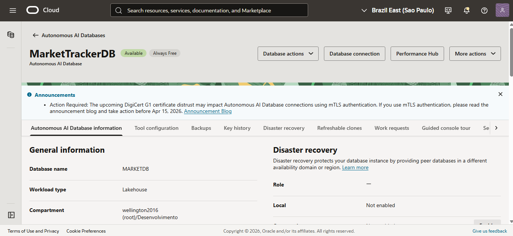
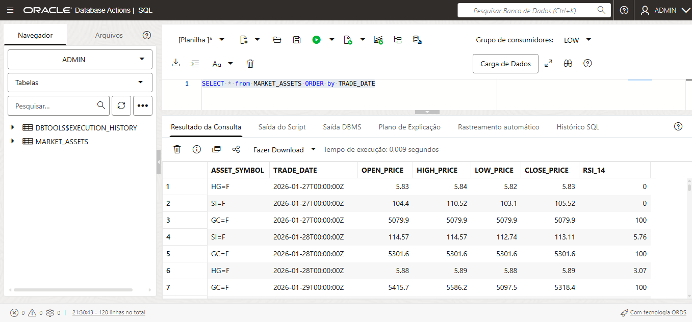
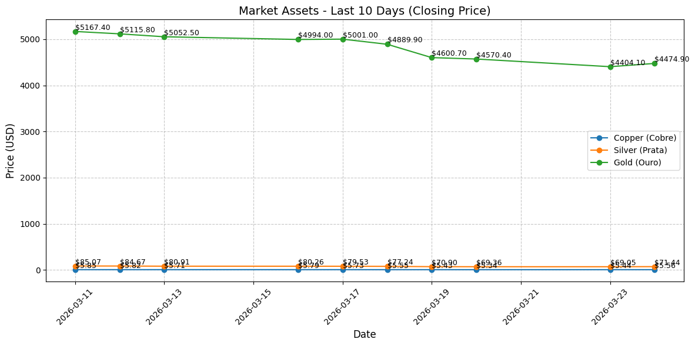

# Oracle-Ace3
A Financial DataBase ingested by OCI

# 📈 OCI Market Data Pipeline: Gold, Silver & Copper

A robust ETL (Extract, Transform, Load) pipeline that synchronizes real-time financial market data with **Oracle Cloud Infrastructure (OCI)** using Python and **Oracle Autonomous Database**.

## 🚀 Overview
This project automates the collection of precious metal prices and technical indicators (RSI) using the `yfinance` API. The data is cleaned, rounded to two decimal places for precision, and synchronized with an OCI Autonomous Database via a secure Wallet connection.

### Key Features
* **Automated ETL**: Fetches daily data for Gold (`GC=F`), Silver (`SI=F`), and Copper (`HG=F`).
* **Data Transformation**: Implements technical analysis (RSI 14) and 2-decimal precision normalization.
* **OCI Integration**: Uses `python-oracledb` with a `MERGE` (Upsert) logic to prevent duplicate records.
* **Relational Mapping**: Connects technical ticker symbols to human-readable names via a metadata lookup table.



## 🛠️ Tech Stack
* **Language**: Python 3.14 (Google Colab Environment)
* **Database**: Oracle Autonomous Database (OCI Always Free Tier)
* **Cloud Platform**: Oracle Cloud Infrastructure (OCI)
* **Libraries**: `yfinance`, `pandas-ta`, `oracledb`, `matplotlib`



## 📂 Project Structure
* `assets_oci.py`: The main Python script for data extraction and OCI synchronization.
* `sql_commands.sql`: SQL scripts to create the `market_assets` table and the `asset_metadata` lookup table.
* `images/`: Dashboard screenshots and verification graphs.

## 🔧 Setup & Installation

### 1. OCI Database Preparation
Run the following SQL in your OCI SQL Worksheet to prepare the relational schema:

```sql
CREATE TABLE market_assets (
    asset_symbol VARCHAR2(10),
    trade_date TIMESTAMP,
    open_price NUMBER,
    high_price NUMBER,
    low_price NUMBER,
    close_price NUMBER,
    rsi_14 NUMBER,
    CONSTRAINT pk_market_assets PRIMARY KEY (asset_symbol, trade_date)
);

CREATE TABLE asset_metadata (
    asset_symbol VARCHAR2(10) PRIMARY KEY,
    asset_name VARCHAR2(50),
    asset_category VARCHAR2(20)
);

INSERT INTO asset_metadata VALUES ('GC=F', 'Gold (Ouro)', 'Metals');
INSERT INTO asset_metadata VALUES ('SI=F', 'Silver (Prata)', 'Metals');
INSERT INTO asset_metadata VALUES ('HG=F', 'Copper (Cobre)', 'Metals');
COMMIT;

pip install oracledb yfinance pandas-ta "pandas<3.0.0"

````
### 2. Python Environment
1. **Upload**: Move your OCI Wallet (`.zip`) to the Google Colab `/content/` directory.
2. **Install Dependencies**:
```bash
   pip install oracledb yfinance pandas-ta "pandas<3.0.0"

Execute: Run assets_oci.py to fetch market data, perform RSI calculations, and populate your cloud database.

```



## 🛠️ Technical Challenges & Solutions

During the development of this ETL pipeline, several architectural and database challenges were solved to ensure production-grade stability:

### 1. Handling `yfinance` MultiIndex Columns
* **Challenge**: Recent updates to the `yfinance` API started returning DataFrames with MultiIndex headers, which caused `AttributeError` during technical indicator calculations and data mapping.
* **Solution**: Implemented a robust conditional check using `df.columns.get_level_values(0)` to flatten the header to a standard single-level Index, ensuring compatibility with `pandas-ta`.

### 2. OCI Parallel DML Locks (ORA-12838)
* **Challenge**: The Oracle Autonomous Database (ADB) often defaults to parallel execution for high performance. This led to `ORA-12838: cannot read/modify an object after modifying it in parallel` during `MERGE` operations.
* **Solution**: Enforced transaction stability by explicitly disabling parallel DML for the session using `cursor.execute("ALTER SESSION DISABLE PARALLEL DML")` prior to data synchronization.

### 3. Data Precision & Normalization
* **Challenge**: Raw financial data from Yahoo Finance contains excessive floating-point precision (8+ decimals). This unnecessarily increases database storage costs and degrades the visual quality of UI dashboards in Oracle APEX.
* **Solution**: Standardized the ETL loop to include a rounding layer using Python’s `round(x, 2)`, normalizing all currency values and RSI indicators before they reach the cloud.

### 4. Relational Data Integrity & Normalization
* **Challenge**: Storing repetitive asset names (e.g., "Gold (Ouro)") within the transaction table is inefficient, increases the risk of data inconsistency, and violates basic database normalization principles.
* **Solution**: Architected a **Lookup Table** (`asset_metadata`) system. This decouples the time-series price data from the asset descriptions, linking them via a `SQL JOIN` or a `VIEW` for optimized query performance and cleaner code maintainability.

---
